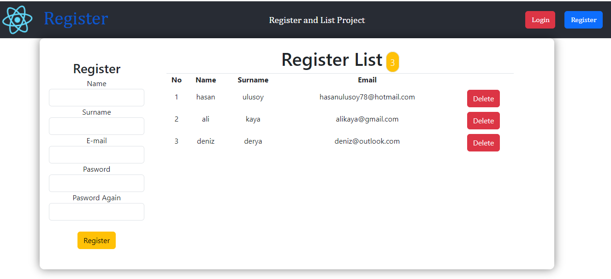

### React Project 6
# REGISTER LİST

## REGISTER KAYIT VE KAYITLARIN LİSTELENMESİ projesidir...
- Bu çalışmada 

-- register alanında yer alan inputlar ile bir state oluşturuldu
-- veriler yan tarafta listelendi.
-- input alanları ad soyad harf ile mail mail formunda 
-- password kısmı ise şifrenin en az 6 haneli olması koşulu sağlandı.
-- password alanları birbiriyle uyumlu olması koşula bağlandı
-- tüm inputlarda veri girişi olmadan kayıt oluşmasına izin verilmedi
-- delete butonu ile listeden o veri silinerek diğer veriler güncellendi
-- list boşken uyarı yazıldı
-- list kısmında listedeki kullanıcı sayısı sayaç ile gösterildi.

## Preview

# Getting Started with Create React App

This project was bootstrapped with [Create React App](https://github.com/facebook/create-react-app).

## Available Scripts

In the project directory, you can run:

### `npm start`

Runs the app in the development mode.\
Open [http://localhost:3000](http://localhost:3000) to view it in your browser.

# Getting Started with Create React App

This project was bootstrapped with [Create React App](https://github.com/facebook/create-react-app).

## Available Scripts

In the project directory, you can run:

### `npm start`

Runs the app in the development mode.\
Open [http://localhost:3000](http://localhost:3000) to view it in your browser.

# Register-List
